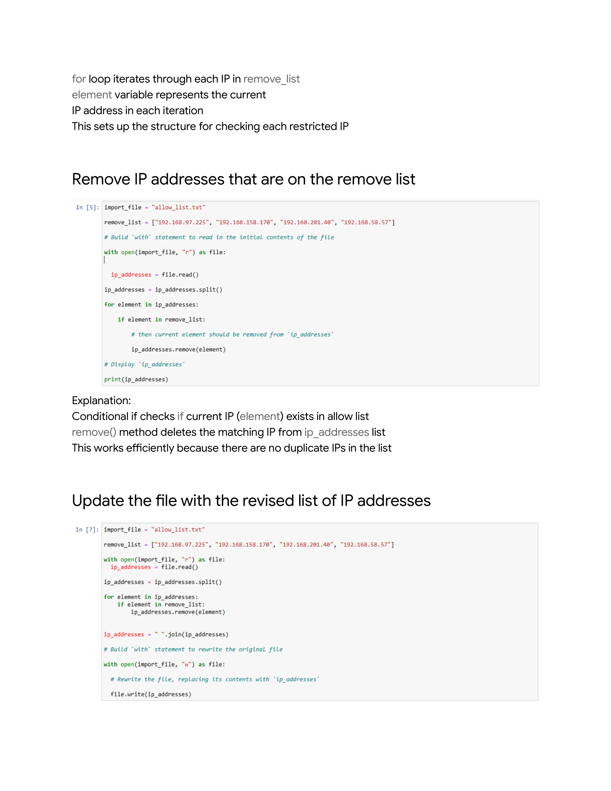

# Algorithm-for-file-updates-in-Python
I will create a portfolio piece demonstrating my Python skills in file handling and content parsing, showcasing algorithm development with real-world applications.
## Scenario

## 

Review the following scenario. Then complete the step-by-step instructions.

You are a security professional working at a health care company. As part of your job, you're required to regularly update a file that identifies the employees who can access restricted content. The contents of the file are based on who is working with personal patient records. Employees are restricted access based on their IP address. There is an allow list for IP addresses permitted to sign into the restricted subnetwork. There's also a remove list that identifies which employees you must remove from this allow list.

Your task is to create an algorithm that uses Python code to check whether the allow list contains any IP addresses identified on the remove list. If so, you should remove those IP addresses from the file containing the allow list.

Note: This scenario involves developing the same algorithm that is developed in Tasks 2-7 of the [Create another algorithm](https://www.coursera.org/learn/automate-cybersecurity-tasks-with-python/ungradedLab/aeLOb/activity-create-another-algorithm) lab. (You do not need to reference Task 1 and Tasks 8-10 of the lab to complete this portfolio activity.) You should revisit the lab to get screenshots to include in your portfolio document.

